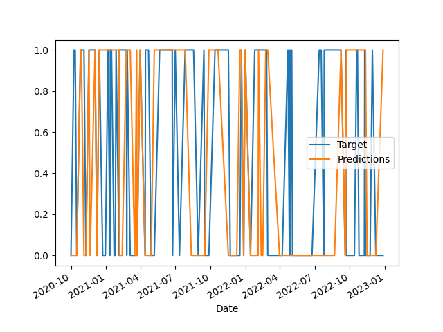

# Predicting Stock Prices Using Machine Learning

This repository contains a simple AI system aimed at predicting the trend of the **NVIDIA stock** prices using machine learning.
The data needed for the analysis are imported through `yfinance`, an open-source tool that uses **Yahoo**'s publicly available APIs to retrieve data about listed stocks.

The financial and banking sectors are incredibly **data-rich**, with millions of transactions and transfers occurring every day.
Machine learning models can be used to understand emerging and underlying trends in order to gain advantage in the **financial sector**.

Check out the [Colab Notebook](stock_prediction.ipynb) to review the execution of the project. 

## Requirements

Since the project relies on some external **libraries**, it is important to keep the dependencies up-yo-date with the latest stable versions of all the libraries and tools used.
The [list of the requirements](requirements.txt) is automatically updated by *Renovate*, which opens a pull request as soon as new updates in the project dependencies are available.

## About the Model

The goal of the model is to predict whether we should **buy** the stock (**target = 1**), meaning that the price is going to increase in the future, or **sell** the stock (**target = 0**), when the price is going to decrease in the future.
The model is trained using data about NVIDIA stock (*Open, High, Low, Close, Volume*) analyzed over a given period, as well as data about main business stakeholders and key financial indicators. 

The **regression** and **classification** algorithms used in the project are featured by the `scikit-learn` machine learning library, while data modeling is mainly performed using the `pandas` software library. 

The project shows three different machine learning models which use different variables and algorithms:

The first model is trained by using *ohlcv* data of BTC, the **Bitcoin USD** price from 2020 until today, and uses the `RandomForestClassifier` as learning algorithm.
The second model uses the same learning algorithm but is trained using some key **financial indicators** like SMA, RSI, OBV and others.
Whereas the third model uses `LinearRegression` with the **exponential moving average** (EMA) as a predictor for the stock closing price.

## Setup

Clone the git repository:

```bash
git clone https://github.com/CescaNeri/ML-stocks-prediction.git && cd ML-stocks-prediction
```

Set up a virtual environment to install dependencies:

```bash
python3 -m venv /path/for/the/virtual/environment
```

Activate the virtual environment:

```bash
source path/bin/activate
```

Install the dependencies:

```bash
pip install -r requirements.txt
```

Now that dependencies are in place, we can **deactivate** the virtual environment and run the program: 

```bash
python stock-prediction.py
```

The program wil ask you to choose a **model** among three options:

```bash
Select a Machine Learning model among these three:

 1. Bitcoin Model (type: 1)

 2. Financial Indicators Model (type: 2)

 3. Regression Model (type: 3)

```

The first and the second model will display the **final accuracy** level directly on the terminal and, at the same time, will save a picture plotting target values vs predicted values over the analyzed period.



The third model will display some key **metrics** useful to evaluate the regression model, which are:

- Standard Deviation
- Mean Absolute Error
- Coefficient of Determination (R2)

As any one of us could guess, the stock market is unstable and, more than often, **unpredictable**.
Of course, fundamental factors such as a company’s intrinsic value, assets, quarterly performance, recent investments, and strategies all affect the traders’ trust in the company and thus the price of its stock. 

Only a few of the latter can be incorporated effectively into a mathematical model, making stock price prediction using machine learning **challenging** and **unreliable** to a certain extent.

[](https://renovatebot.com/)
[](https://github.com/renovatebot/renovate/actions)


