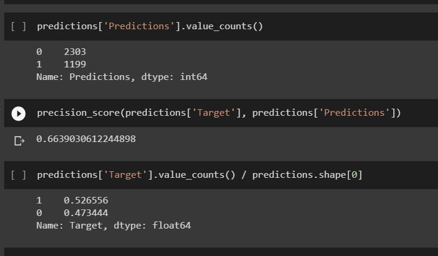
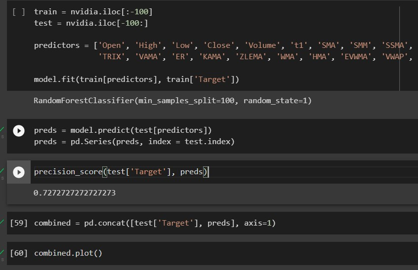

# Random Ideas

Maybe we can select a shorter time horizon (instead of taking all the data, we can focus only on the last 10 years ?)

- Add financial indicators from finTa library (as a column ?) 
- Add relevant data to the table to increase accuracy 
    - primary key: date
    - stock price of stakeholders:
        - major clients (boh, videogames I guess)
        - key partners that are listed in the SE
        - *maybe we can add competitors' trend* (intel & AMD)
    

Additional data may be useful for the analysis BUT we should also select the most appropriate period.
(if we include the stock price of a main customer, it can be misleading with past data, when the company in question wasn't a nvidia customer)

[See NVIDIA business model canvas](https://vizologi.com/business-strategy-canvas/nvidia-business-model-canvas/)

## Tests and Accuracy

**Predictors**: ['Open', 'High', 'Low', 'Close', 'Volume', 't1']

**Classifier**: RandomForestClassifier(n_estimators=100, min_samples_split=100, random_state=1)

**Backtest**: 1

**Time Horizons**: 0

**Predictors**: ['OBV', 'ADL', 'ADX', 'RSI', 'STOCH', 'SMA']

**Cassifier**:  RandomForestClassifier(n_estimators=100, min_samples_split=100, random_state=1)

**Backtest**: 0

**Time Horizons**: 0

